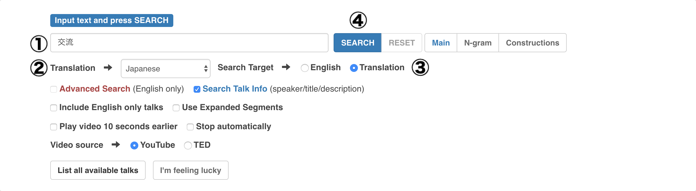
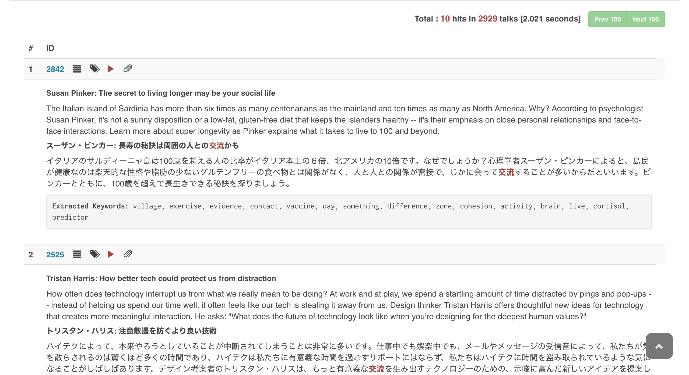

# Search in talk information in translated language

To search in translated text of titles, speaker names, descriptions, and keywords of talks:

1. Choose `Translation Language`
2. Set `Search Target` to `Translation`
3. Click on `SEARCH`

