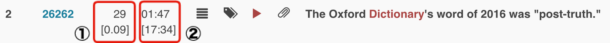

# Check location of a segment

* `[1]` indicates the segment number and its relative position \(0 being the onset and 1 the outset\)
* `[2]` indicates the time position of the segment and total playing time of the talk

