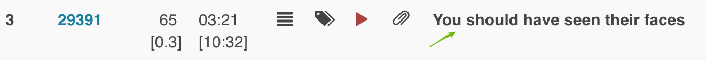
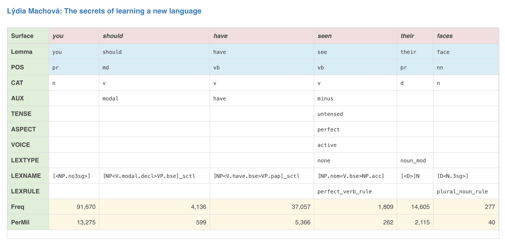

# Check syntactic information

A click on the segment text on search results will open a syntactic information panel

All the transcript data in TCSE is annotated with the results of syntactic analysis using [Enju](http://www.nactem.ac.uk/enju/), a syntactic parser for English.

