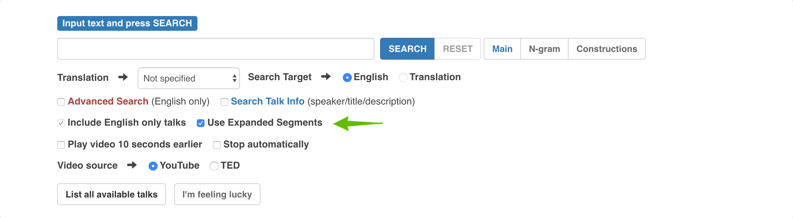
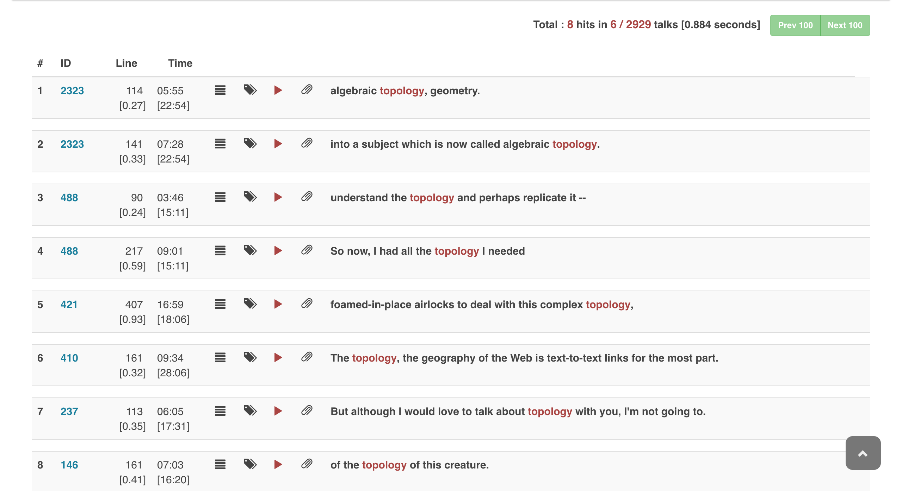
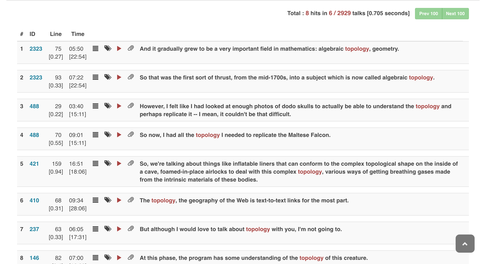

# Switch to expanded segment mode

An **expanded segment** is composed by concatenating one or more segments so that the resulting unit contains at least one whole sentence. An **normal segment**, on the other hand, can be made of a fragment of a sentence.

To use expanded segments, check `Use Expanded Segments` before making a new search

**In normal segment mode**

**In expanded segment mode**

