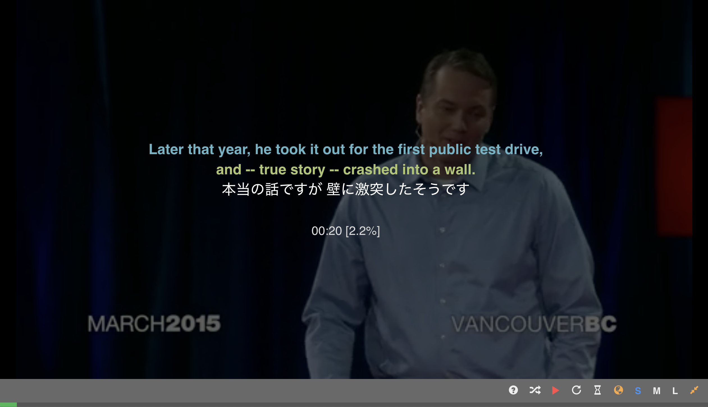

# Switch to fullscreen

Click on `fullscreen` icon or press `ESC` key while playing video will switch from normal viewing mode to fullscreen mode and vice versa. In fullscreen viewing mode, the transcrpt \(and its translation text\) will be shown only when the video is paused, which greatly helps those who watch TED videos to train their English listening skills.

**Normal viewing mode**

**Fullscreen viewing mode**

