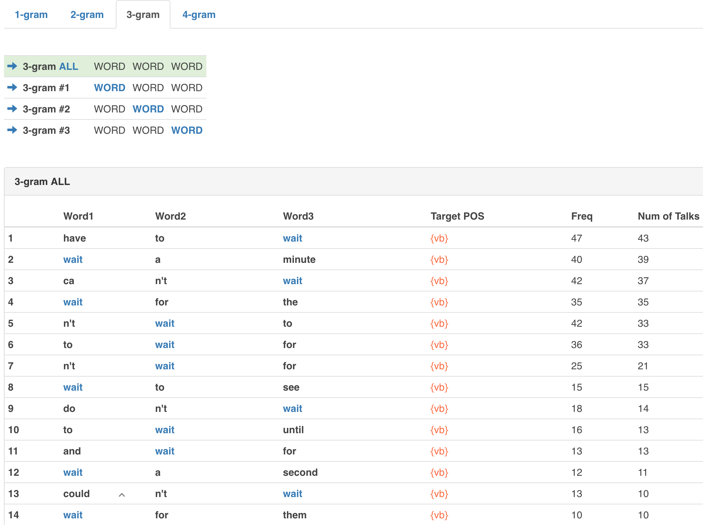
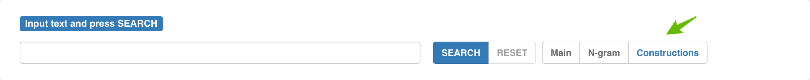
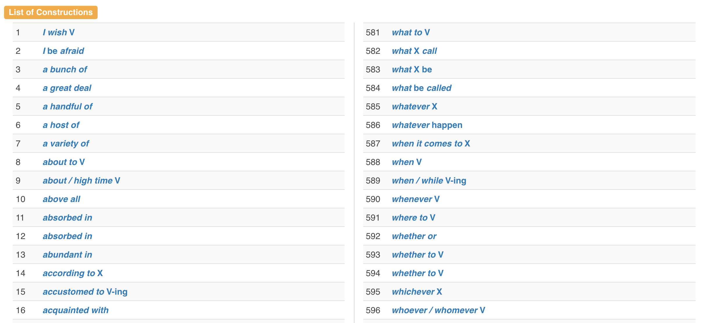

# Constructions

Click on `Constructions` in the main page of TCSE.

1,160 constructions \(including veryous kinds of idiomatic expressions, phrasal verbs, etc.\) have been collected that have multiple usage instances in TCSE database. Though the procedure of collecting these constructions is not systematic but rather heuristic, the list will be helpful for users who are learners and educators of English.

Each construction has a link to a page in which the clickable link for searching instances containing the construction and an example sentence. The example sentences are not from TED talks but they are newly created ones. \(Sample sentences can be freely used for non-commercial uses but the creator of TCSE retains copyright.\)

