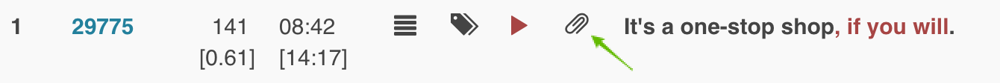
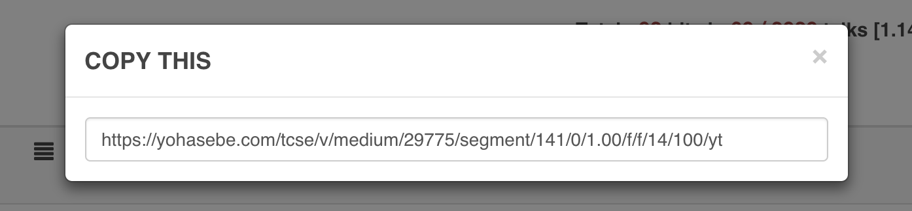

# Get unique URL of a segment

Each of the segments listed as a search result has a unique URL with which one can load and play any segment later. To obtain the URL, you can click on the clip icon in the search results.

The unique URL of the segment will be presented in a pop up window

