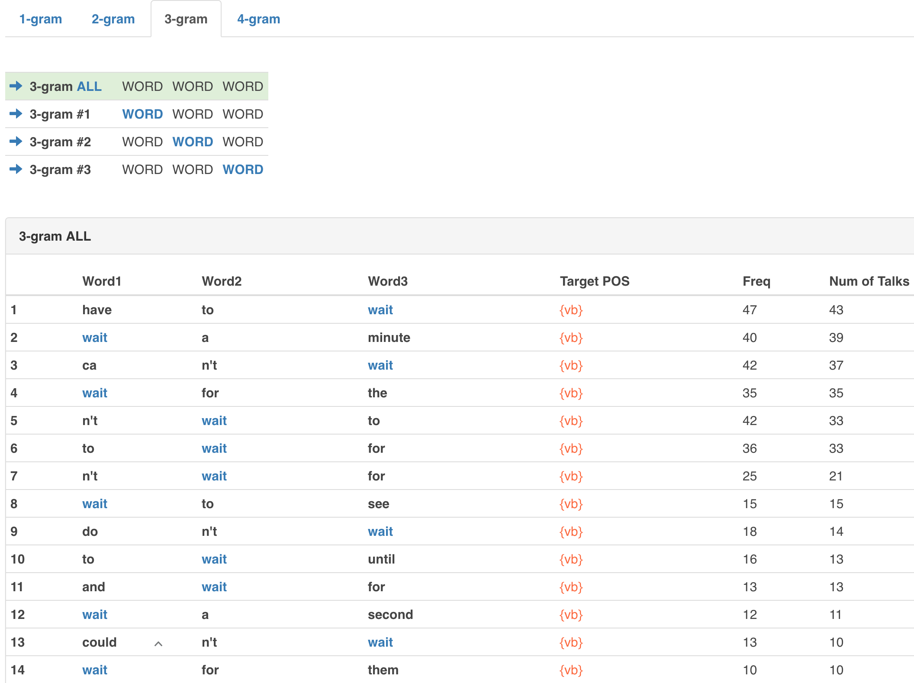

# N-grams

You can look at n-grams of words in TED Talks. Click on `N-gram` button on the main page.

An n-gram is a sequence of words of n \(2, 3, 4, ...\) items. Looking at \(differences of\) frequencies of various n-grams, it is expected that one can find out what linguistic sequences are more entrenched in the mind of speakers of the language and, possibly, what are less so.

Here is a sample output returned in response to the search key _wait_

